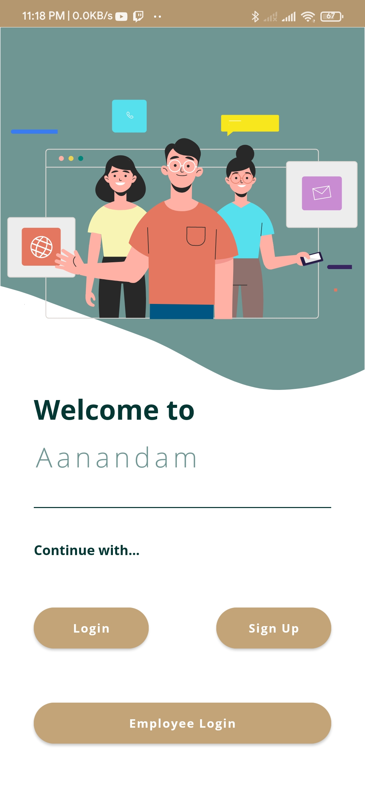
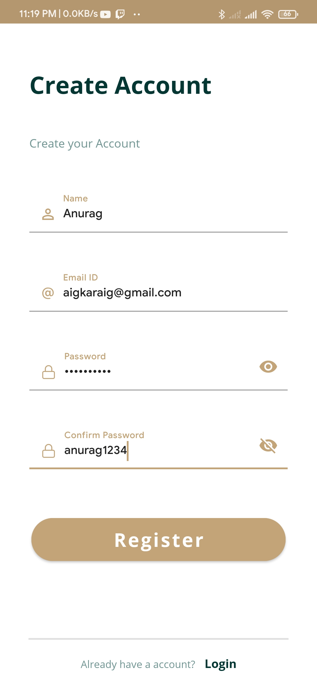
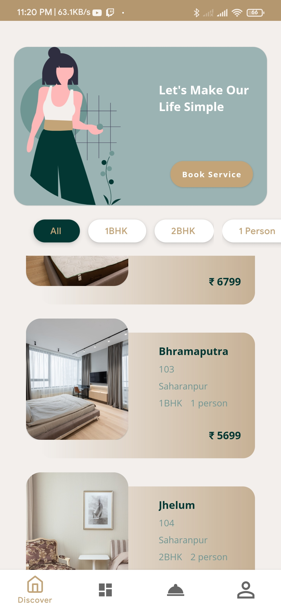
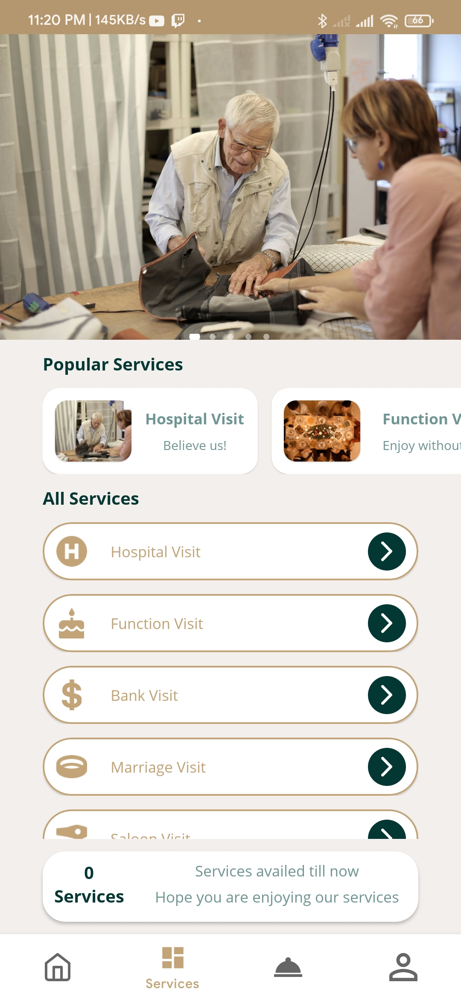
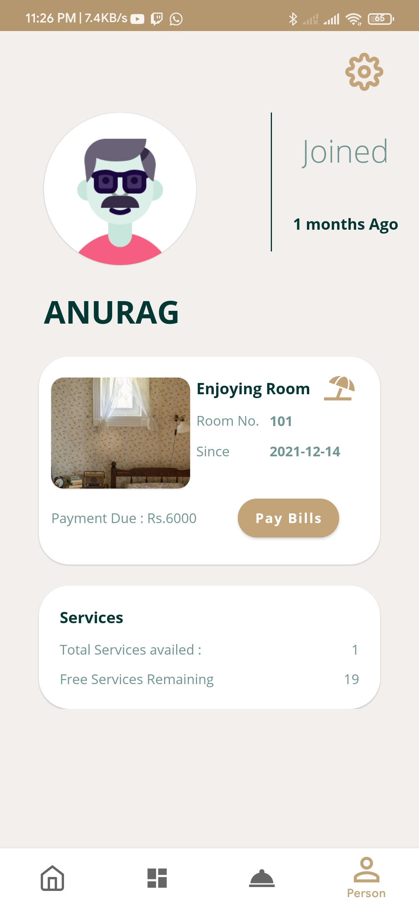

# Aanandam
Our product will provide homecare services to anyone above the age of a particular threshold. Our product is designed to provide comfort and assistance. The product provides clients with a living space at a lower cost and in a more comfortable environment. It also provides a clubbing system for senior people who live near to their homes and want to socialize with others.
The user can browse our services here, but they must first sign up to use any of them. The consumer will now have the option of acquiring a full apartment, living in it, or renting it out for a price, thereby becoming a premium user with access to all of the product's features. Our services include hospital visits, bank visits, personal function visits, and any other type of visit that requires support. All people will now be able to use these services for free. As a result, the purchaser is just required to pay for the room.
Now, if a consumer merely wants service and doesn't want to own or rent a room, our product can help. In that instance, the consumer has the option of signing up for a one-day, monthly, or yearly subscription. Except for medical visits, the consumer can only get a restricted number of visits with this service.

# Developement Info
<h2>Rachit - Backend</h2>
<ul>
  <li>MongoDB has been used for the database.</li> 
  <li>Server/API has been created using Node.js/Express</li>
  <li>API has been tested and documented using Postman. API calls are being used to serve the application.</li>
  <li>API has been hosted on herouku platform.</li>
  <li>Website is also hosted on heroku platform.</li>
</ul>
<h2>Shreya - Landing Page and Documentation</h2>
<ul>
  <li>Landing page has been created using HTML, CSS, SASS, JavaScript.</li> 
  <li>The complete SRS documention of the project has been done.</li>
  <li></li>
  
</ul>

# Screenshots of the App
<table>
  <tr>
    <td>Login/SignUp</td>
    <td>Forgot Password</td>
    <td>SignUp Page</td>
  </tr>
  <tr>
    <td></td>
    <td></td>
    <td></td>
  </tr>
  <tr>
    <td>Home Page</td>
    <td>Room Description</td>
    <td>Room Booking</td>
  </tr>
  <tr>
    <td></td>
    <td></td>
    <td></td>
  </tr>
  <tr>
    <td>Services</td>
    <td>Service Description</td>
    <td>Service Booking</td>
  </tr>
  <tr>
    <td></td>
    <td></td>
    <td></td>
  </tr>
  <tr>
    <td>Payment Portal</td>
    <td>Payment Status</td>
    <td>Profile Page</td>
  </tr>
  <tr>
    <td></td>
    <td></td>
    <td></td>
  </tr>
 <tr>
    <td>Employee Profile</td>
    <td>Leave Application</td>
    <td>Loading Page</td>
  </tr>
  <tr>
    <td></td>
    <td></td>
    <td></td>
  </tr>
</table>
 
# Link to the landing page: https://young-ravine-63777.herokuapp.com/ 
One can register on the landing page and further will have to install the app.
# Link to the API Documentation: https://documenter.getpostman.com/view/18321901/UVJkCZEy
